# Modul1_Probstat_5025211213

Repository ini berisi kode dan output dari praktikum 1 mata kuliah Probabilistik
dan Statistika milik:

- Nama	: Richie Seputro
- NRP	: 5025211213
- Kelas	: Probabilistik dan Statistika A

## Penjelasan Jawaban

### Nomor 1

Seorang penyurvei secara acak memilih orang-orang di jalan sampai dia bertemu
dengan seseorang yang menghadiri acara vaksinasi sebelumnya.

a) Berapa peluang penyurvei bertemu x = 3 orang yang tidak menghadiri acara
   vaksinasi sebelum keberhasilan pertama ketika p = 0,20 dari populasi
   menghadiri acara vaksinasi ? (distribusi Geometrik)

Kode:

```{r}
x <- 3
p <- 0.2

for (i in seq(1, 5)) {
	print(sprintf("P(Y = x) #%d = %g", i, dgeom(x, p)))
}
```

Output:

```
[1] "P(Y = x) #1 = 0.1024"
[1] "P(Y = x) #2 = 0.1024"
[1] "P(Y = x) #3 = 0.1024"
[1] "P(Y = x) #4 = 0.1024"
[1] "P(Y = x) #5 = 0.1024"
```

b) Mean Distribusi Geometrik dengan 10000 data random , prob = 0,20 dimana
   distribusi geometrik acak tersebut X = 3 (distribusi geometrik acak() == 3)

Kode:

```{r}
n <- 10000
p <- 0.2

for (i in seq(1, 10)) {
  print(sprintf("Mean #%d = %g", i, mean(rgeom(n, p) == 3)))
}
```

Output:

```
[1] "Mean #1 = 0.1048"
[1] "Mean #2 = 0.1003"
[1] "Mean #3 = 0.1015"
[1] "Mean #4 = 0.1025"
[1] "Mean #5 = 0.1012"
[1] "Mean #6 = 0.1008"
[1] "Mean #7 = 0.105"
[1] "Mean #8 = 0.1086"
[1] "Mean #9 = 0.1004"
[1] "Mean #10 = 0.1016"
```

c) Bandingkan Hasil poin a dan b , apa kesimpulan yang bisa didapatkan?

Kode:

```{r}
msg <- "Berdasarkan hasil output dari poin (a) dan (b), dapat disimpulkan bahwa
pada poin (b), dengan menggunakan sebuah random variable yang dihasilkan secara
pseudo-random oleh fungsi rgeom, akan dihasilkan output yang bisa berubah pada
setiap pemanggilannya. Perilaku ini berbeda dengan hasil pada poin (a) di mana
hasil yang dihasilkan selalu tetap.
"

cat(msg)
```

Output:

```
Berdasarkan hasil output dari poin (a) dan (b), dapat disimpulkan bahwa
pada poin (b), dengan menggunakan sebuah random variable yang dihasilkan secara
pseudo-random oleh fungsi rgeom, akan dihasilkan output yang bisa berubah pada
setiap pemanggilannya. Perilaku ini berbeda dengan hasil pada poin (a) di mana
hasil yang dihasilkan selalu tetap.
```

d) Histogram Distribusi Geometrik , Peluang X = 3 gagal Sebelum Sukses Pertama

Kode:

```{r}
hist(rgeom(n, p), main = "Histogram Distribusi Geometrik", labels = TRUE)
```

Output:

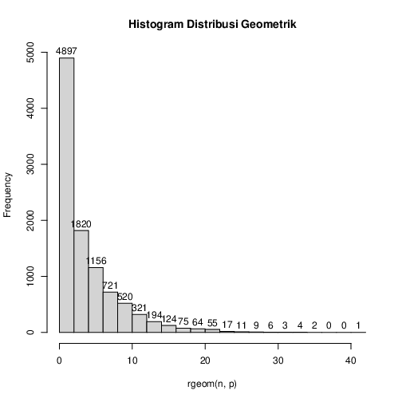

e) Nilai Rataan (μ) dan Varian (σ²) dari Distribusi Geometrik.

Kode:

```{r}
msg <- "Rataan (μ) dapat dicari dengan rumus 1/p untuk mencapai keberhasilan pertama
dan dengan rumus (1-p)/p untuk x-1 kegagalan sebelum keberhasilan pertama.

Varians (σ²) dapat dicari dengan rumus (1-p)/(p^2).
"

cat(msg)
mgeom = (1 - p)/p
vgeom = (1 - p)/(p^2)
sprintf("μ = %g", mgeom)
sprintf("σ² = %g", vgeom)
```

Output:

```
Rataan (μ) dapat dicari dengan rumus 1/p untuk mencapai keberhasilan pertama
dan dengan rumus (1-p)/p untuk x-1 kegagalan sebelum keberhasilan pertama.

Varians (σ²) dapat dicari dengan rumus (1-p)/(p^2).

[1] "μ = 4"
[1] "σ² = 20"
```

### Nomor 2

Terdapat 20 pasien menderita Covid19 dengan peluang sembuh sebesar 0.2. Tentukan:

a) Peluang terdapat 4 pasien yang sembuh.

Kode:

```{r}
x <- 4
n <- 20
p <- 0.2
sprintf("B(x; n, p) = %g", dbinom(x, n, p))
```

Output:

```
[1] "B(x; n, p) = 0.218199"
```

b) Gambarkan grafik histogram berdasarkan kasus tersebut.

Kode:

```{r}
x <- seq(0, 20)
plot(x, dbinom(x, n, p),
	type = 'h',
	main = "Histogram Distribusi Binomial",
	ylab = "Probabilitas",
	lwd = 5)
```

Output:

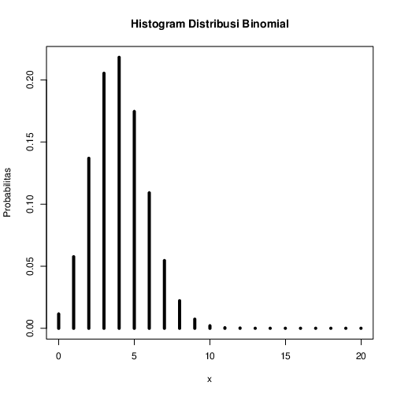

c) Nilai Rataan (μ) dan Varian (σ²) dari Distribusi Binomial.

Kode:

```{r}
msg <- "Rataan (μ) dapat dicari dengan rumus n*p.

Varians (σ²) dapat dicari dengan rumus n*p*q atau n*p*(1-p).
"

cat(msg)
mbinom = n*p
vbinom = n*p*(1-p)
sprintf("μ = %g", mbinom)
sprintf("σ² = %g", vbinom)
```

Output:

```
Rataan (μ) dapat dicari dengan rumus n*p.

Varians (σ²) dapat dicari dengan rumus n*p*q atau n*p*(1-p).

[1] "μ = 4"
[1] "σ² = 3.2"
```

### Nomor 3

Diketahui data dari  sebuah tempat bersalin di rumah sakit tertentu menunjukkan
rata-rata historis 4,5 bayi lahir di rumah sakit ini setiap hari. (gunakan Distribusi Poisson)

a) Berapa peluang bahwa 6 bayi akan lahir di rumah sakit ini besok?

Kode:

```{r}
x <- 6
l <- 4.5
sprintf("Pois(l) = %g", dpois(x, l))
```

Output:

```
[1] "Pois(l) = 0.12812"
```

b) Simulasikan dan buatlah histogram kelahiran 6 bayi akan lahir di rumah sakit
   ini  selama setahun (n = 365)

Kode:

```{r}
n <- 365
hist(rpois(n, l), main = "Histogram Distribusi Poisson", xlab = "Jumlah bayi", labels = TRUE)
```

Output:

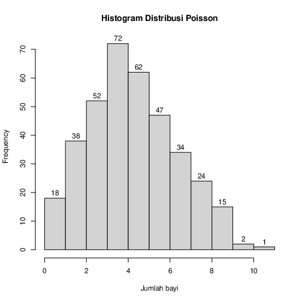

c) dan bandingkan hasil poin a dan b , Apa kesimpulan yang bisa didapatkan

Kode:

```{r}
sprintf("Hasil poin (a) dikalian 365 = %g", dpois(x, l) * n)

msg <- "Hasil poin (a) hanya mempertimbangkan terjadinya kelahiran 6 bayi pada
hari besok (1 hari saja), sedangkan poin (b) mempertimbangkan hal yang sama tapi
dalam periode 365 hari. Setelah hasil poin (a) dikalikan dengan 365 untuk menyamakan
dengan hasil poin (b), didapatkan hasil yang hampir mendekati dengan nilai pada
histogram poin (b).
"

cat(msg)
```

Output:

```
[1] "Hasil poin (a) dikalian 365 = 46.7639"

Hasil poin (a) hanya mempertimbangkan terjadinya kelahiran 6 bayi pada
hari besok (1 hari saja), sedangkan poin (b) mempertimbangkan hal yang sama tapi
dalam periode 365 hari. Setelah hasil poin (a) dikalikan dengan 365 untuk menyamakan
dengan hasil poin (b), didapatkan hasil yang hampir mendekati dengan nilai pada
histogram poin (b).
```

d) Nilai Rataan (μ) dan Varian (σ²) dari Distribusi Poisson.

Kode:

```{r}
msg <- "Rataan (μ) setara dengan lambda.

Varians (σ²) juga setara dengan lambda.
"

cat(msg)
sprintf("μ = %g", l)
sprintf("σ² = %g", l)
```

Output:

```
Rataan (μ) setara dengan lambda.

Varians (σ²) juga setara dengan lambda.

[1] "μ = 4.5"
[1] "σ² = 4.5"
```

### Nomor 4

Diketahui nilai x = 2 dan v = 10. Tentukan:

a) Fungsi Probabilitas dari Distribusi Chi-Square.

Kode:

```{r}
x <- 2
v <- 10
sprintf("X²(v) = %g", dchisq(x, v))
```

Output:

```
[1] "X²(v) = 0.00766416"
```

b) Histogram dari Distribusi Chi-Square dengan 100 data random.

Kode:

```{r}
hist(rchisq(100, v), main = "Histogram Distribusi Chi-Squared", labels = TRUE)
```

Output:

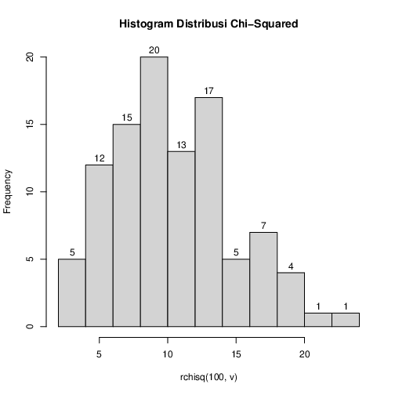

c) Nilai Rataan (μ) dan Varian (σ²) dari Distribusi Chi-Square.

Kode:

```{r}
msg <- "Rataan (μ) setara dengan v.

Varians (σ²) setara dengan 2*v.
"

cat(msg)
sprintf("μ = %g", v)
sprintf("σ² = %g", 2*v)
```

Output:

```
Rataan (μ) setara dengan v.

Varians (σ²) setara dengan 2*v.

[1] "μ = 10"
[1] "σ² = 20"
```

### Nomor 5

Diketahui bilangan acak (random variable) berdistribusi exponential (λ = 3). Tentukan:

a) Fungsi Probabilitas dari Distribusi Exponensial 

Kode:

```{r}
n <- 10
l <- 3
paste("f(λ) = ", dexp(n, l))
print("Distribution:")
paste(rexp(n, l))
```

Output:

```
[1] "f(λ) =  2.80728689065205e-13"

[1] "Distribution:"
  [1] "0.410507118625844"
  [2] "0.0172867931736012"
  [3] "0.259155614338375"
  [4] "0.0720318544012305"
  [5] "0.128704570699483"
  [6] "0.260469697449437"
  [7] "0.0329220408263306"
  [8] "1.51565013941668"
  [9] "0.31509110408105"
  [10] "0.269739027633349"
```

b) Histogram dari Distribusi Exponensial untuk 10, 100, 1000 dan 10000 bilangan random

Kode:

```{r}
hist(rexp(10, l), main = "Histogram Distribusi Exponensial, n = 10", labels = TRUE)
hist(rexp(100, l), main = "Histogram Distribusi Exponensial, n = 100", labels = TRUE)
hist(rexp(1000, l), main = "Histogram Distribusi Exponensial, n = 1000", labels = TRUE)
hist(rexp(10000, l), main = "Histogram Distribusi Exponensial, n = 10000", labels = TRUE)
```

Output:

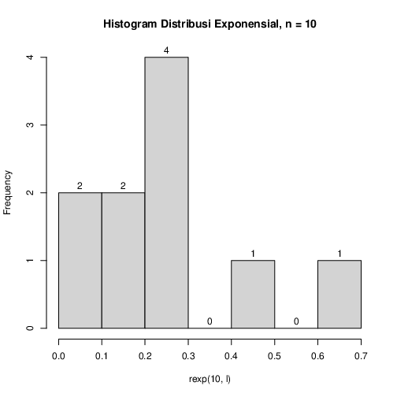

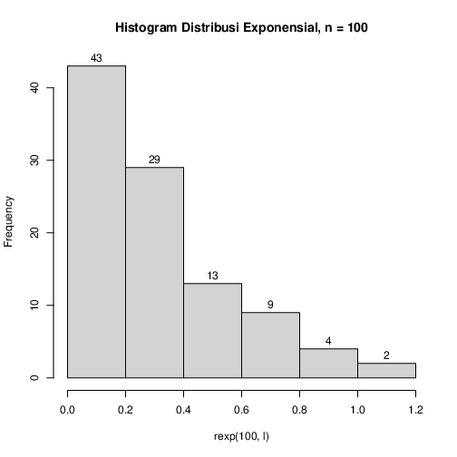

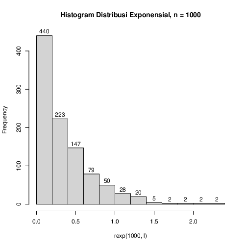

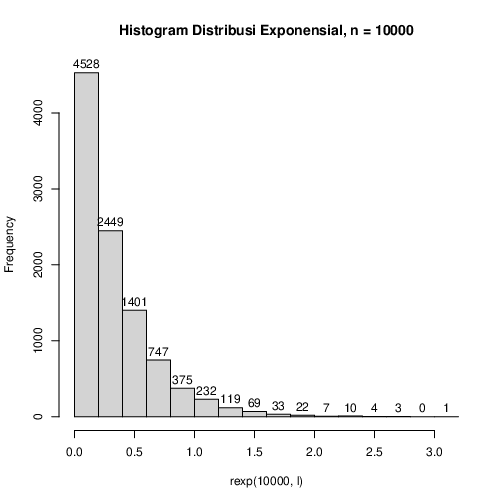

c) Nilai Rataan (μ) dan Varian (σ²) dari Distribusi Exponensial untuk n = 100 dan λ = 3
   Petunjuk:

- Gunakan set.seed(1)
- Gunakan fungsi bawaan R

Kode:

```{r}
n <- 100
l <- 3
set.seed(1)
paste("Rataan (μ) = ", mean(rexp(n, l)))
set.seed(1)
paste("Varians (σ²) = ", var(rexp(n, l)))
```

Output:

```
[1] "Rataan (μ) =  0.343558812019206"
[1] "Varians (σ²) =  0.0974443032622406"
```

### Nomor 6

Diketahui generate random nilai sebanyak 100 data, mean = 50, sd = 8. Tentukan

a) Fungsi Probabilitas dari Distribusi Normal P(X1 ≤ x ≤ X2),
   hitung Z-Score-nya dan plot data generate randomnya dalam bentuk grafik.
   Petunjuk(gunakan fungsi plot()).

   Keterangan : 

     X1 = Dibawah rata-rata 
     X2 = Diatas rata-rata

   Contoh data :

     1,2,4,2,6,3,10,11,5,3,6,8

     rata-rata = 5.083333
     X1 = 5
     X2 = 6

Kode:

```{r}
n <- 100
m <- 50
stddev <- 8

paste("N(μ,σ²) = ", dnorm(n, m, stddev))

d <- rnorm(n, m, stddev)

plot(d, type = "o", col = "blue", main = "Distribusi Normal, n = 100, mean = 50, sd = 8")

x1 <- floor(mean(d))
x2 <- ceiling(mean(d))

zs <- (d - mean(d)) / sd(d)
plot(zs, type = "o", col = "red", main = "Z-Score Distribusi Normal, n = 100, mean = 50, sd = 8")
```

Output:

```
[1] "N(μ,σ²) =  1.64250227269486e-10"
```

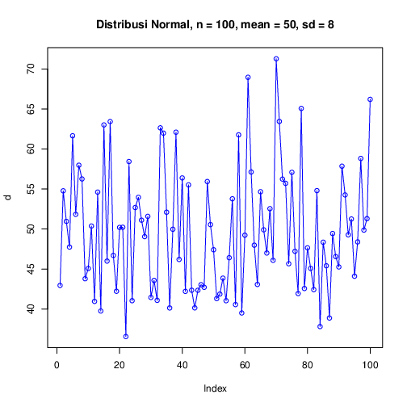

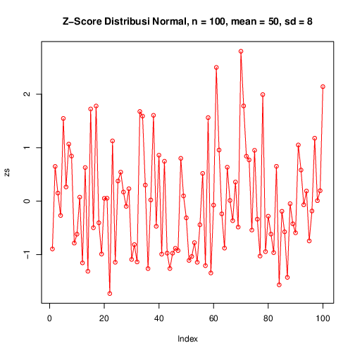

b) Generate Histogram dari Distribusi Normal dengan breaks 50 dan format penamaan: 
   NRP_Nama_Probstat_{Nama Kelas}_DNhistogram

   Contoh :

      312312312_Rola_Probstat_A_DNhistogram

Kode:

```{r}
hist(rnorm(n, m, stddev), breaks = 50, main = "5025211213_Richie Seputro_Probstat_A_DNhistogram")
```

Output:

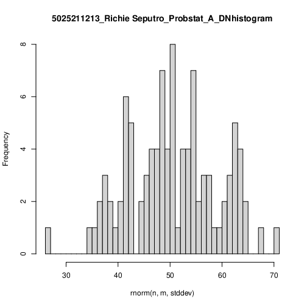

c) Nilai Varian (σ²) dari hasil generate random nilai Distribusi Normal.

Kode:

```{r}
paste("Varians (σ²) = ", sd(rnorm(n, m, stddev)) ^ 2)
```

Output:

```
[1] "Varians (σ²) =  53.345988915105"
```
